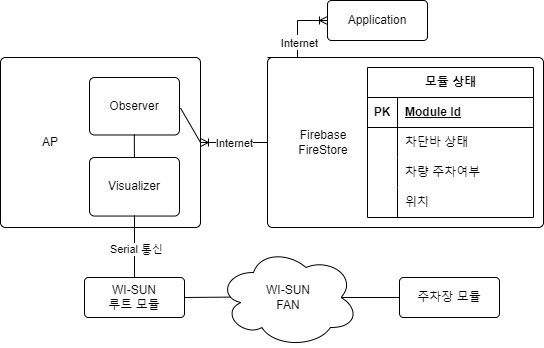
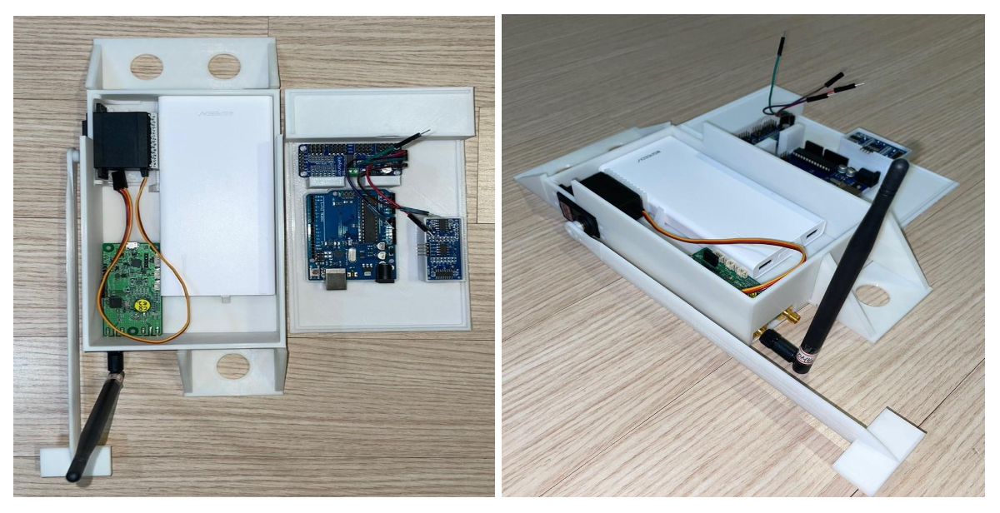
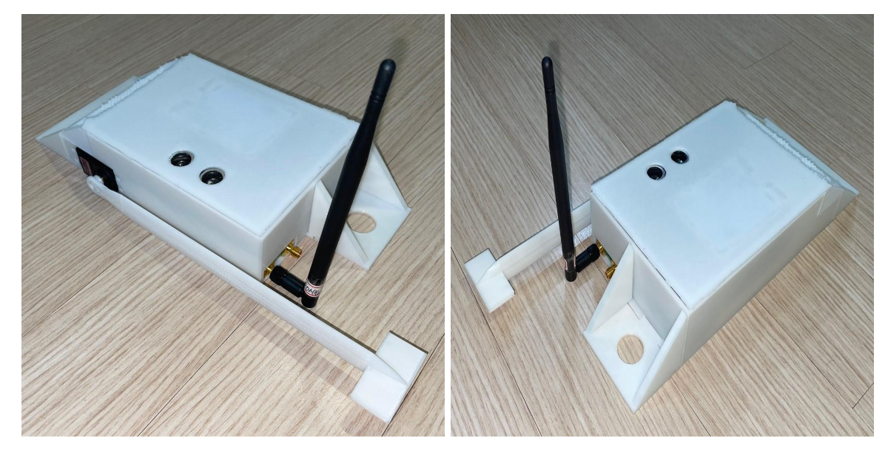
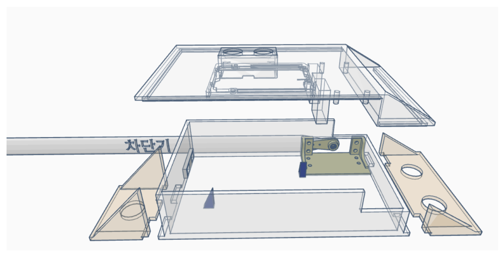
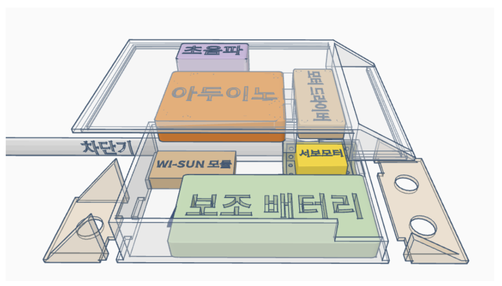

# **WI-SUN FAN 네트워크를 활용한 스마트 공유 주차장**

## 1. 프로젝트 소개
자동차는 대부분의 시간을 주차장에서 보내고, 운전자는 주행 시간의 30% 이상을 주차 공간을 찾는데 쓴다는 연구 결과가 있습니다. 하지만, 기존의 여러 공유 주차장 서비스들이 있었음에도 불구하고, '부정 주차 문제'로 인한 한계점이 명확했습니다. 

저희는 '부정 주차 문제'를 해결하고자 차단기가 부착된 공유 주차장 모듈을 제작하였습니다. 이를 활용해 IoT 기반의 공유 주차장 솔루션을 제시하고 주차 비효율 문제를 해결하는데 도움을 주고자 합니다.

## 2. 팀 소개
- 지도 교수님: 정상화 교수님
- 지도 조교님: 이희준 조교님

|이름|정우영|이창주|홍유준|
|-|-|-|-|
|github| [](https://github.com/wyj3569) | [](https://github.com/busbtvi) | [](https://github.com/Kick-snare) |
|학번|201824580|201824565|201824615|
|email|wyjung0731@gmail.com|busbtvi@gmail.com| hyjhyj0901@naver.com |
|역할|Wi-SUN 모듈 개발|서버 & 케이싱|안드로이드 앱 개발|

## 3. 구성도
- 전체적인 서비스의 구조도

| 서비스 전체 구조도 |  |
| --- | :--- |
| **어플리케이션 서버** | 앱에서 활용할 데이터를 저장, Firebase의 FireStore를 활용 | 
| **AP(AccessPoint)** | 각 wi-sun 네트워크가 인터넷에 접속하기 위한 gateway |
| **WI-SUN Root Module** | AP에 연결되어 wi-sun fan 네트워크와 인터넷을 연결하는 역활 | 
| **주차장 모듈** | 차단기와 wi-sun 모듈을 포함하여, 주차장 바닥에 간단히 설치할 수 있는 모듈 |
| **애플리케이션** | 서버와 통신하며 사용자에게 UI 인터페이스를 제공 |

## 4. 소개 및 시연 영상

| [](https://www.youtube.com/watch?v=-8N5LV3WuaA) |
| --- |

## 5. 사용법
> 이 프로젝트에 사용된 Wi-SUN 모듈의 경우, 기술적 권리로 인해 배포 및 공개가 금지되어 있습니다.
> 따라서, 해당 모듈과 관련된 source code 및 사용법은 이 repository 및 README에 포함하지 않았습니다.

### 5.1 주차장 모듈
> 주차장 모듈은 주차공간 소유자가 자신의 주차장에 간편하게 설치하여, 부정주차 차량을 차단할 수 있는것을 목표로 개발되었습니다.

#### 완성된 모듈

|  |  |
| --- | --- |

- 위의 주차장 모듈은 주차면에 차량이 주차되어 있는지 여부를 실시간으로 파악합니다.
- 주차장 모듈에 부정 주차를 방지할 수 있는 차단바 기능을 구현했습니다.
- 차단바의 움직임은 사용자가 애플리케이션을 통해서 조작합니다.
- 우리 공유 주차장 시스템은 Wi-SUN FAN 네트워크를 이용하여 통신합니다. 

Wi-SUN FAN 네트워크를 이용한 통신을 간략히 요약하면 다음과 같습니다.

- Wi-SUN FAN 네트워크의 모든 패킷은 루트 노드를 경유한다.
- 루트 노드를 관찰하는 옵저버를 둔다.
- 옵저버는 Wi-SUN 모듈과 서버 사이의 패킷을 중간에서 연결하는 역할을 수행한다.


### 5.2 Observer
> observer는 AP에서 실행되어, firebase와 wi-sun 모듈간의 양방향 통신을 책임지는 python 코드입니다.

<details>
<summary>How to run</summary>
    
#### How to run

1. python 3.* version
2. firebase 프로젝트에서 firebaseCredential.json을 다운받아 observer.py와 동일한 경로에 배치한다. 
    - 프로젝트 설정 -> 서비스 계정 -> 새 비공개키 생성
3. wireshark를 활용해 wi-sun모듈이 사용하고 있는 인터페이스 및 포트를 확인
    - port: observer.py 16 line 수정
    ```python
    port = ????
    ```
    - interface: observer.py 88 line 'iface' 값 수정
    ```python
    sniff(iface="????", prn = handlePacket, count = 0)
    ```
4. run observer.py

</details>


<details>
<summary>코드 설명</summary>

#### 코드 설명
- 서버를 firebase로 사용하고 있기 때문에, firebase 까지 업데이트를 하면 어플리케이션에서 자동으로 반영

1. 모듈 -> 어플리케이션
    1. 주차장 모듈에 설치된 wi-sun 모듈이 root 로 데이터를 전송
    2. root 모듈은 AP에 있는 visualizer에게 전달
    3. 2번의 과정을 python의 scapy를 활용해 캡처
        ```python
        from scapy.all import *
        sniff(iface="wisun", prn = handlePacket, count = 0)
        ```
    4. 패킷을 분석해 필요한 데이터 추출
        ```python
        def handlePacket(rowPacket)
        ```
    5. firestore에 업데이트
        ```python
        def updateDocument(mac, isOcupied): nodeRef.document(mac).update({"isOcupied": isOcupied})
        ```
2. 어플리케이션 -> 모듈
    1. observer에서 firestore에 대한 EventListener 등록
        ```python
        # 변화를 감지할 collection(일종의 table)
        nodeRef = firestore.client().collection("module")
        
        # 현재 observer와 관련된 문서만 탐지
        col_query = nodeRef.where(filter=FieldFilter("observerId", "==", observerId))
        query_watch = col_query.on_snapshot(documnetEventListener)
        ```
    2. 문서의 flag 필드값을 확인
        ```python
        for change in changes:
            if change.type.name == "MODIFIED":
                msg = 0 if change.document.get("isBlocked") else 1
        ```
    3. 데이터(제어신호)를 socket을 활용해, interface로 전달
        ```python
        def sendToNode(dst, msg):
        print("sendToNode")
        sendSocket.connect((dst, port))
        sendSocket.send(msg.to_bytes(1, 'big'))
        ```
</details>


### 5.3 Android


사용자의 모바일 어플리케이션과 주차장 모듈 간의 통신을 위해 Firebase의 FireStore 서비스를 사용한다. 모듈과 모바일 앱과 같은 다른 클라이언트와 통신하기 위해서 많은 부분이 계층화되어 있기 때문에 모바일 애플리케이션은 주차장 관련 정보를 오직 firestore를 인터페이스로 주고 받는다. 


#### 회원가입 및 로그인

| 로그인 | SNS연동 | 회원가입 |
| --- | --- | --- |
|  |  |  |

주차장을 대여하거나, 제공하는 사용자 모두 회원가입을 통해 로그인이 필요하다. 간편한 로그인을 지원하기 위해 카카오의 SNS 로그인을 지원하도록 연동하였다. 따라서 사용자는 별다른 입력 없이 바로 로그인 할 수 있다.

#### 지도 기반 주차장 탐색

|  |  |  |  |
| --- | --- | --- | --- | 

기본적으로 앱을 실행하였을 때 사용자는 지도를 통해 주차장의 여러 정보를 얻을 수 있다. 자신의 위치를 비롯한 주차장들의 위치와 이름이 지도상의 마커로 표시 된다. 

하단 네비게이션바 위 쪽의 “-” 모양의 핸들을 드래그하여 올리게 되면 주차장들의 간략한 정보가 담긴 카드 리스트가 노출된다. 이는 지도 상에 노출되는 주차장들의 더욱 자세한 정보를 알 수 있으며, 카드 우측 상단의 별 모양을 통해 즐겨찾기를 등록 또는 해제 가능하다. 이는 서버에 즉시 반영되며, 등록된 주차장은 “즐겨찾기” 탭에서 모아 보기 가능하다.

주차장 마커를 클릭하거나, 아래 리스트에서 카드를 클릭하게 되면 왼쪽 화면과 같이 지도의 시점이 고정되며 현재 위치로부터 주차장 위치의 경로를 애니메이션으로 보여준다. 동시에 지도 상에 떠있는 주차장 카드가 노출되며, 해당 카드를 클릭하면 주차장의 상세 정보와 함께 결제를 할 수 있는 화면으로 이동하게 된다.


### 사용 시간에 따른 필터링

| 주차장 사용 시간 | 날짜 선택 | 시간 선택 |
| --- | --- | --- |
|  |  |  |

사용자는 자신이 주차를 원하는 시작 시간과 종료 시간을 설정하여 이 조건에 맞게 사용할 수 있는 주차장을 탐색하고, 해당하는 가격을 결제하여 사용할 수 있다. 편리한 사용을 위해 아래 “+” 또는 “-”가 붙은 버튼을 클릭하여 간편하게 시간을 조정할 수 있다. 하단 아래의 큰 버튼을 눌러 적용한다.


| 주차장 사용 시간 | 날짜 선택 | 시간 선택 | ㅇㅇ |
| --- | --- | --- | --- |
|  |  |  |  |

주차장을 제공자로서 사용하기 위해서는 모듈을 동작시켜 네트워크상에 연결되고 나서, 주차장에 대한 세부 정보와 제공자가 누구인지 등 등록하는 과정이 필요하다. 추후 모듈을 제공할 때 케이스에 QR스티커 등을 부착하여 모바일 애플리케이션에서 카메라로 인식하여 간단하게 구현할 수 있도록한다. 
 인식이 된 모듈은 주차장의 이름, 위치, 가격등을 설정하여 서버에 저장되고, 최종적으로 사용자에게 노출되게 된다. 


### 5.4 Casing(H/W)
> 이번 과제에서 사용된 모든 모델링 파일은 /docs/files/*.stl 파일에 있습니다.

케이싱은 주차장 모듈에 필요한 센서와 보드들이 모두 안전하게 보관 및 동작할 수 있도록 모델링을 진행하였다. 

|  |  | 
| --- | --- |

- 차단바를 움직이는데 필요한 서보모터의 구동축은 바깥에서 보이도록 하였고, WI-SUN 모듈의 안테나도 외부에서 장착할 수 있도록 제작했다.
- 초음파 센서는 위쪽의 차량의 주차여부를 판단해야 되기 때문에 케이싱의 뚜껑부분에 장착될 수 있도록 제작했다.


#### 전체 케이싱

|  |  | 
| --- | --- |

- 모듈이 주차장 바닥에 안정적으로 고정될 수 있도록 케이싱의 좌우에 지지부를 따로 빼내어 바닥에 볼트를 박을 수 있도록 설계
- 지지부가 케이스에 정확히 연결 될 수 있도록 케이싱 및 지지부에 가이드 추가

