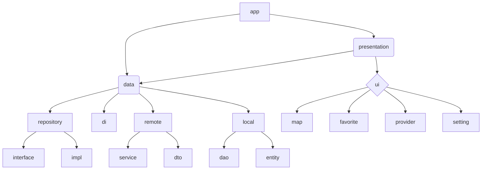

# NormalizeParkingLot-android
Normalize the Parking Lot (NPL) android repository

### How To Run
```
1. add local.properties
2. sync gradle
3. build & run
```
request @kick-snare `local.properties` that contains api key

### app architecture


with MVVM

### tech stacks
- Jetpack Compose
- Kotlin Coroutine
- Dagger Hilt
- FireStore
- Retrofit
- Coil
- etc...
